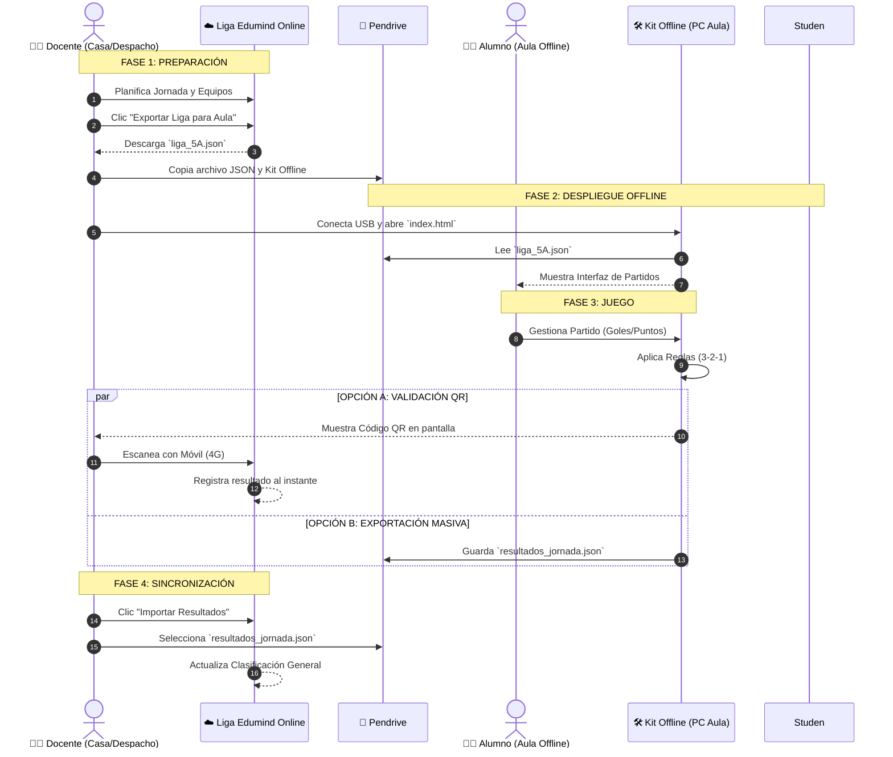
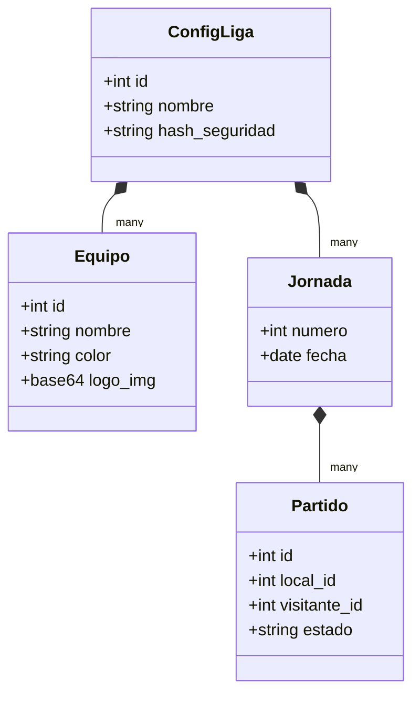

# 🌍 Plan Estratégico: Solución Híbrida "Satélite"
> **Proyecto:** Liga EDUmind Offline  
> **Fecha:** 21 Enero 2026  
> **Estrategia:** Non-Intrusive Satellite Client (Sin modificar el Core actual)

---

## 1. Visión General: El Modelo Satélite

La solución propone un ecosistema donde la plataforma online (`liga.edumind.es`) sigue siendo la fuente de verdad, pero se extiende al aula mediante **satélites offline**: herramientas ligeras y desechables que viven en un pendrive.

### 🏗️ Arquitectura del Sistema

```mermaid
graph TB
    subgraph "NUBE (Edumind Online)"
        Server[☁️ Servidor Central]
        DB[(Base de Datos)]
        Server <--> DB
    end

    subgraph "PUENTE (Docente)"
        Movil[📱 Móvil del Docente]
        USB[💾 Pendrive de Clase]
    end

    subgraph "AULA (Offline)"
        PC1[💻 PC Aula 1]
        PC2[💻 PC Aula 2]
        PC3[💻 PC Aula 3]
        
        Kit[🛠️ Kit Offline (Satélite)]
    end

    Server --"1. Exportar JSON Config"--> USB
    USB --"2. Cargar Liga"--> PC1
    USB --"2. Cargar Liga"--> PC2
    
    PC1 --"3. Partidos & Arbitraje"--> Kit
    
    Kit --"4. Generar QR"--> Movil
    Movil -. "4a. Sync 4G" .-> Server
    
    Kit --"5. Guardar JSON Resultados"--> USB
    USB --"6. Importar JSON"--> Server

    classDef cloud fill:#e1f5fe,stroke:#01579b,stroke-width:2px;
    classDef bridge fill:#fff3e0,stroke:#e65100,stroke-width:2px;
    classDef offline fill:#e8f5e9,stroke:#1b5e20,stroke-width:2px;
    
    class Server,DB cloud;
    class Movil,USB bridge;
    class PC1,PC2,PC3,Kit offline;
```

---

## 2. Flujo de Trabajo (User Journey)

El ciclo de vida de una jornada de liga bajo este modelo es circular y asíncrono.



---

## 3. Estructura de Datos (Intercambio)

Para garantizar que el sistema online y el offline "hablen el mismo idioma" sin estar conectados, definimos dos contratos de datos estrictos.

### 📦 Paquete de Ida: "Configuración de Liga"
Este archivo (`liga_config.json`) viaja del Servidor al Aula. Contiene todo lo necesario para pintar la interfaz offline.



### 📦 Paquete de Vuelta: "Resultados"
Este es el *payload* que viaja de vuelta, ya sea dentro del QR o en el archivo JSON de cierre.

```json
{
  "sync_id": "uuid-v4-random",
  "liga_id": 127,
  "timestamp": "2026-01-21T10:00:00Z",
  "resultados": [
    {
      "match_id": 4056,
      "marcador": {
        "goles_local": 3,
        "goles_visitante": 2
      },
      "puntos": {
        "local": 3,
        "visitante": 1
      },
      "metadatos": {
        "juego_limpio": 5,
        "validado_por": "docente_qr"
      }
    }
  ]
}
```

---

## 4. Componentes Técnicos Requeridos

Para hacer realidad este plan sin tocar el núcleo de la aplicación, necesitamos desarrollar estos 3 artefactos:

| Componente | Tipo | Descripción | Ubicación |
| :--- | :--- | :--- | :--- |
| **1. Exportador Backend** | `API Endpoint` | Genera el JSON completo de la liga (equipos + calendario). | `api/export_league` |
| **2. Kit Satélite** | `Web Standalone` | Archivo `HTML+JS` único. Contiene toda la lógica de UI y reglas. No requiere servidor. | `USB/PC Aula` |
| **3. Importador Backend** | `API Endpoint` | Recibe el JSON de resultados, valida hashes y actualiza la DB. | `api/import_results` |

### ✨ Ventaja Clave
> Este diseño permite actualizar la lógica del juego o las reglas en el "Kit Offline" simplemente copiando un nuevo archivo HTML al pendrive, sin necesidad de desplegar nuevas versiones en el servidor ni arriesgar la estabilidad de la plataforma principal.
